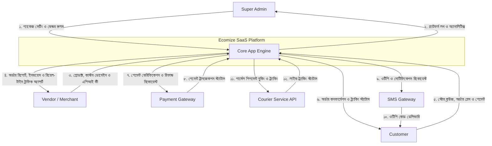
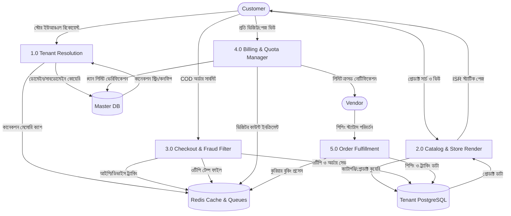

# Ecomize — Data Flow Diagram (DFD)

---

## **১. Level 0: Context Diagram (সিস্টেমের বাহ্যিক ডেটা প্রবাহ)**

সিস্টেমের সাথে ব্যবহারকারী ও এক্সটার্নাল এপিআই-এর মধ্যকার উচ্চ-স্তরের ডেটা প্রবাহ:

---

## **২. Level 1: Core Process DFD (মূল প্রসেস ভিত্তিক ডেটা প্রবাহ)**

সিস্টেমের ভেতরের ডাটাবেস ও মডিউলগুলোর মধ্যে কীভাবে ডেটা প্রবাহিত হয় তা নিচে দেখানো হলো:

---

## **৩. ডেটা ফ্লো বিবরণী (Data Flow Descriptions)**

### **৩.১ ডোমেইন ও টেন্যান্ট ডিটেকশন (Tenant Resolution)**
* **ইনপুট ডেটা:** গ্রাহকের ব্রাউজার থেকে আসা `Host Header` (যেমন: `mstore.com` বা `store1.ecomize.com`)।
* **প্রসেস:** NestJS মিডলওয়্যার `Master DB` ও `Redis` থেকে এই ডোমেইনের বিপরীতে বরাদ্দকৃত PostgreSQL কানেকশন স্ট্রিং খুঁজে বের করে।
* **আউটপুট:** রানটাইমে নির্দিষ্ট টেন্যান্ট ডাটাবেসে কানেক্ট হয়ে স্টোর রেন্ডার করা।

### **৩.২ চেকআউট ও অ্যান্টি-ফ্রড প্রসেস (Checkout & Anti-Fraud)**
* **ইনপুট ডেটা:** কাস্টমারের ফোন নম্বর, আইপি অ্যাড্রেস এবং চেকআউট ডিটেইলস।
* **প্রসেস:** `Redis` দিয়ে একই আইপি ও ডিভাইস থেকে অর্ডারের ফ্রিকোয়েন্সি রিড করা হয়। ফ্রড ডিটেক্ট না হলে ওটিপি জেনারেট করে এসএমএস গেটওয়েতে পাঠানো হয়।
* **আউটপুট:** ওটিপি ভেরিফাইড অর্ডার ডেটা টেন্যান্টের ডাটাবেসে (`Tenant DB`) সেভ হওয়া এবং কার্ট ক্লিয়ার হওয়া।

### **৩.৩ ট্রাফিক কোটা ও মেম্বারশিপ প্রসেস (Quota & Billing)**
* **ইনপুট ডেটা:** কাস্টমারের পেজ ভিজিট ইভেন্ট।
* **প্রসেস:** `Redis`-এ ভেন্ডর আইডি ভিত্তিক ভিজিটর কাউন্টার ১ করে বাড়তে থাকে। কাউন্টারের ভ্যালু মেম্বারশিপ প্ল্যান লিমিটের সাথে মিলিয়ে দেখা হয়।
* **আউটপুট:** লিমিট ওভারফ্লো হলে ভেন্ডর ড্যাশবোর্ডে "Limit Exceeded" অ্যালার্ট ফায়ার করা এবং অতিরিক্ত ট্রাফিকের ক্ষেত্রে স্ট্যাটিক ক্যাশ পেজ রেন্ডার করা।
