# Ecomize — Exhaustive Feature-Wise Data Flow Diagrams (DFDs)

---

## **১. Super Admin Features**

### **১.১ Vendor Onboarding, Suspension & Deletion (ভেন্ডর অনবোর্ডিং, সাসপেনশন ও ডিলিট)**
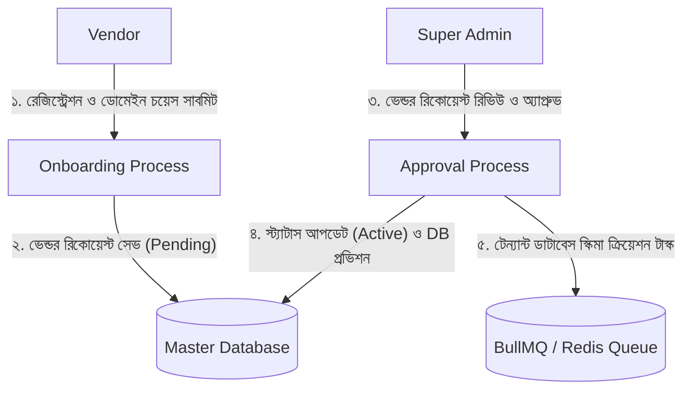
```mermaid
graph TD
    Vendor[Vendor] -->|"১. রেজিস্ট্রেশন ও ডোমেইন চয়েস সাবমিট"| Reg["Onboarding Process"]
    Reg -->|"২. ভেন্ডর রিকোয়েস্ট সেভ (Pending)"| MasterDB[("Master Database")]
    SA[Super Admin] -->|"৩. ভেন্ডর রিকোয়েস্ট রিভিউ ও অ্যাপ্রুভ"| Appr["Approval Process"]
    Appr -->|"৪. স্ট্যাটাস আপডেট (Active) ও DB প্রভিশন"| MasterDB
    Appr -->|"৫. টেন্যান্ট ডাটাবেস স্কিমা ক্রিয়েশন টাস্ক"| Queue[("BullMQ / Redis Queue")]
```

### **১.২ Tenant Monitoring (টেন্যান্ট ডাটাবেস সাইজ ও রিসোর্স ট্র্যাকিং)**
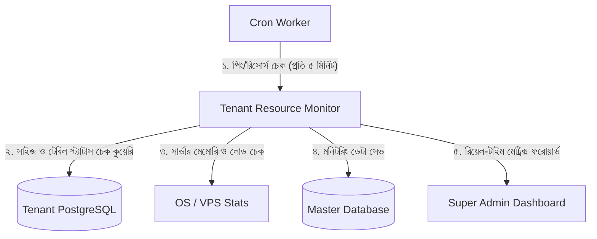
```mermaid
graph TD
    Cron["Cron Worker"] -->|"১. পিং/রিসোর্স চেক (প্রতি ৫ মিনিট)"| Monitor["Tenant Resource Monitor"]
    Monitor -->|"২. সাইজ ও টেবিল স্ট্যাটাস চেক কুয়েরি"| DB[("Tenant PostgreSQL")]
    Monitor -->|"৩. সার্ভার মেমোরি ও লোড চেক"| OS["OS / VPS Stats"]
    Monitor -->|"৪. মনিটরিং ডেটা সেভ"| MasterDB[("Master Database")]
    Monitor -->|"৫. রিয়েল-টাইম মেট্রিক্স ফরোয়ার্ড"| Dashboard["Super Admin Dashboard"]
```

### **১.৩ Tenant Impersonation (সুপার এডমিন ছদ্মবেশ লগইন)**
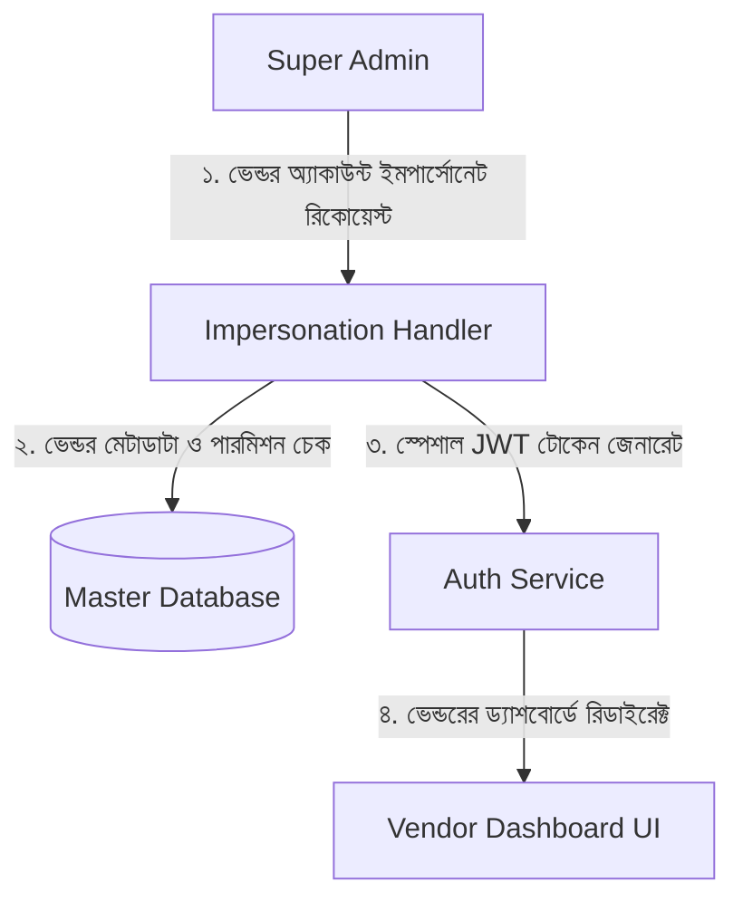
```mermaid
graph TD
    SA["Super Admin"] -->|"১. ভেন্ডর অ্যাকাউন্ট ইমপার্সোনেট রিকোয়েস্ট"| Imp["Impersonation Handler"]
    Imp -->|"২. ভেন্ডর মেটাডাটা ও পারমিশন চেক"| MasterDB[("Master Database")]
    Imp -->|"৩. স্পেশাল JWT টোকেন জেনারেট"| Token["Auth Service"]
    Token -->|"৪. ভেন্ডরের ড্যাশবোর্ডে রিডাইরেক্ট"| Dashboard["Vendor Dashboard UI"]
```

### **১.৪ Plan & Subscription Engine (বিলিং এবং লিমিট সেটআপ)**
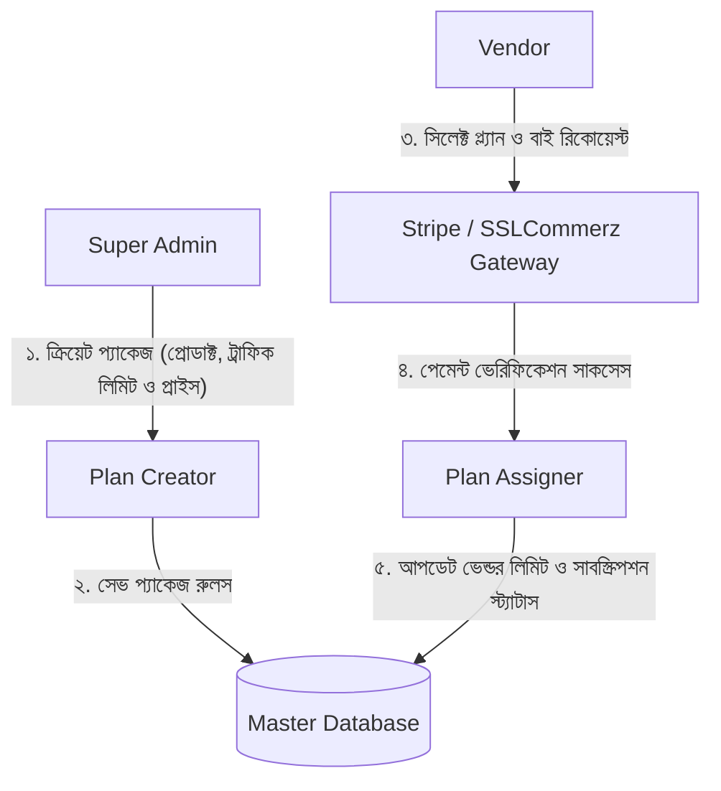
```mermaid
graph TD
    SA["Super Admin"] -->|"১. ক্রিয়েট প্যাকেজ (প্রোডাক্ট, ট্রাফিক লিমিট ও প্রাইস)"| PlanCreator["Plan Creator"]
    PlanCreator -->|"২. সেভ প্যাকেজ রুলস"| MasterDB[("Master Database")]
    Vendor["Vendor"] -->|"৩. সিলেক্ট প্ল্যান ও বাই রিকোয়েস্ট"| Payment["Stripe / SSLCommerz Gateway"]
    Payment -->|"৪. পেমেন্ট ভেরিফিকেশন সাকসেস"| PlanAssign["Plan Assigner"]
    PlanAssign -->|"৫. আপডেট ভেন্ডর লিমিট ও সাবস্ক্রিপশন স্ট্যাটাস"| MasterDB
```

### **১.৫ Usage Alert (লিমিট ও কোটা সতর্কতা নোটিফিকেশন)**
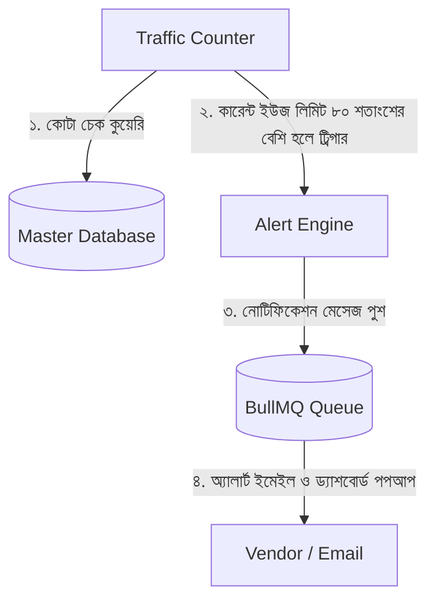
```mermaid
graph TD
    Traffic["Traffic Counter"] -->|"১. কোটা চেক কুয়েরি"| MasterDB[("Master Database")]
    Traffic -->|"২. কারেন্ট ইউজ লিমিট ৮০ শতাংশের বেশি হলে ট্রিগার"| Alert["Alert Engine"]
    Alert -->|"৩. নোটিফিকেশন মেসেজ পুশ"| Queue[("BullMQ Queue")]
    Queue -->|"৪. অ্যালার্ট ইমেইল ও ড্যাশবোর্ড পপআপ"| Vendor["Vendor / Email"]
```

### **১.৬ Global Theme Management (থিম আপলোড ও রোলআউট)**
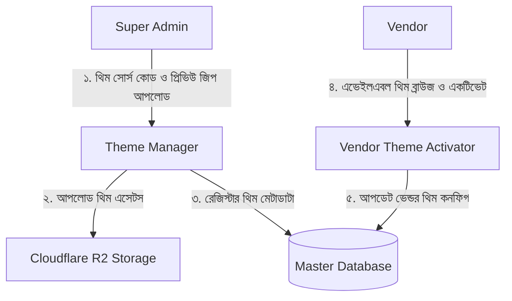
```mermaid
graph TD
    SA["Super Admin"] -->|"১. থিম সোর্স কোড ও প্রিভিউ জিপ আপলোড"| ThemeLoader["Theme Manager"]
    ThemeLoader -->|"২. আপলোড থিম এসেটস"| Storage["Cloudflare R2 Storage"]
    ThemeLoader -->|"৩. রেজিস্টার থিম মেটাডাটা"| MasterDB[("Master Database")]
    Vendor["Vendor"] -->|"৪. এভেইলএবল থিম ব্রাউজ ও একটিভেট"| StoreTheme["Vendor Theme Activator"]
    StoreTheme -->|"৫. আপডেট ভেন্ডর থিম কনফিগ"| MasterDB
```

### **১.৭ Custom Domain Setup & SSL (কাস্টম ডোমেইন ও SSL সার্টিফিকেশন)**
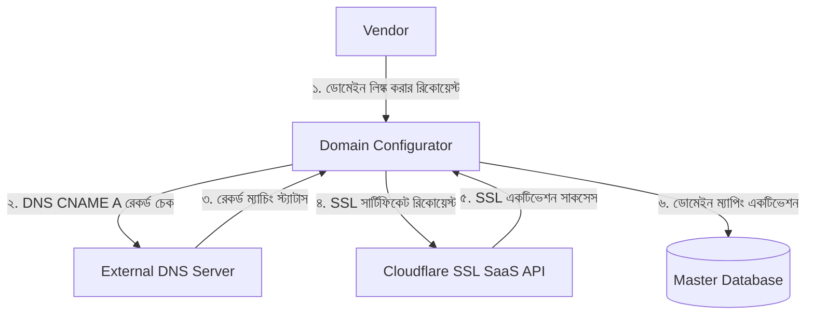
```mermaid
graph TD
    Vendor["Vendor"] -->|"১. ডোমেইন লিঙ্ক করার রিকোয়েস্ট"| Config["Domain Configurator"]
    Config -->|"২. DNS CNAME A রেকর্ড চেক"| DNS["External DNS Server"]
    DNS -->|"৩. রেকর্ড ম্যাচিং স্ট্যাটাস"| Config
    Config -->|"৪. SSL সার্টিফিকেট রিকোয়েস্ট"| Cloudflare["Cloudflare SSL SaaS API"]
    Cloudflare -->|"৫. SSL একটিভেশন সাকসেস"| Config
    Config -->|"৬. ডোমেইন ম্যাপিং একটিভেশন"| MasterDB[("Master Database")]
```

### **১.৮ System Logs & Security (অডিট লগ ও ২এফএ সেটিংস)**
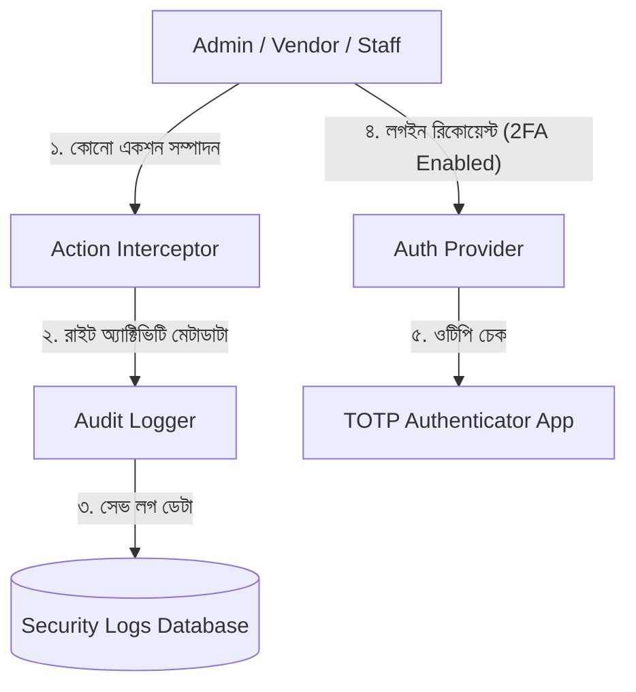
```mermaid
graph TD
    User["Admin / Vendor / Staff"] -->|"১. কোনো একশন সম্পাদন"| Action["Action Interceptor"]
    Action -->|"২. রাইট অ্যাক্টিভিটি মেটাডাটা"| Logger["Audit Logger"]
    Logger -->|"৩. সেভ লগ ডেটা"| LogDB[("Security Logs Database")]
    User -->|"৪. লগইন রিকোয়েস্ট (2FA Enabled)"| Auth["Auth Provider"]
    Auth -->|"৫. ওটিপি চেক"| Totp["TOTP Authenticator App"]
```

---

## **২. Vendor Dashboard Features**

### **২.১ Storefront Builder (ড্র্যাগ-অ্যান্ড-ড্রপ লেআউট কনফিগ সেভ)**
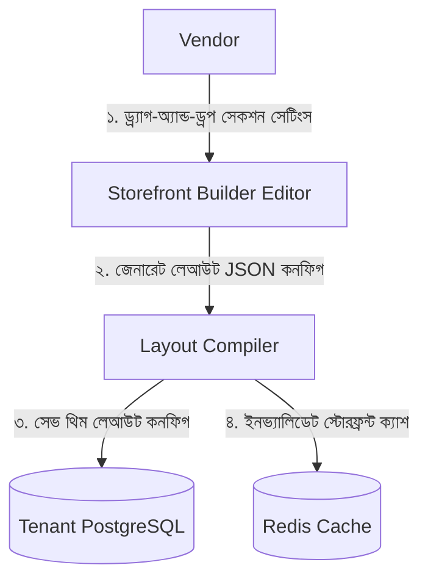
```mermaid
graph TD
    Vendor["Vendor"] -->|"১. ড্র্যাগ-অ্যান্ড-ড্রপ সেকশন সেটিংস"| Editor["Storefront Builder Editor"]
    Editor -->|"২. জেনারেট লেআউট JSON কনফিগ"| Compiler["Layout Compiler"]
    Compiler -->|"৩. সেভ থিম লেআউট কনফিগ"| DB[("Tenant PostgreSQL")]
    Compiler -->|"৪. ইনভ্যালিডেট স্টোরফ্রন্ট ক্যাশ"| Redis[("Redis Cache")]
```

### **২.২ Product Catalog & Bulk CSV Upload (প্রোডাক্ট ক্যাটালগ ও বাল্ক আপলোড)**
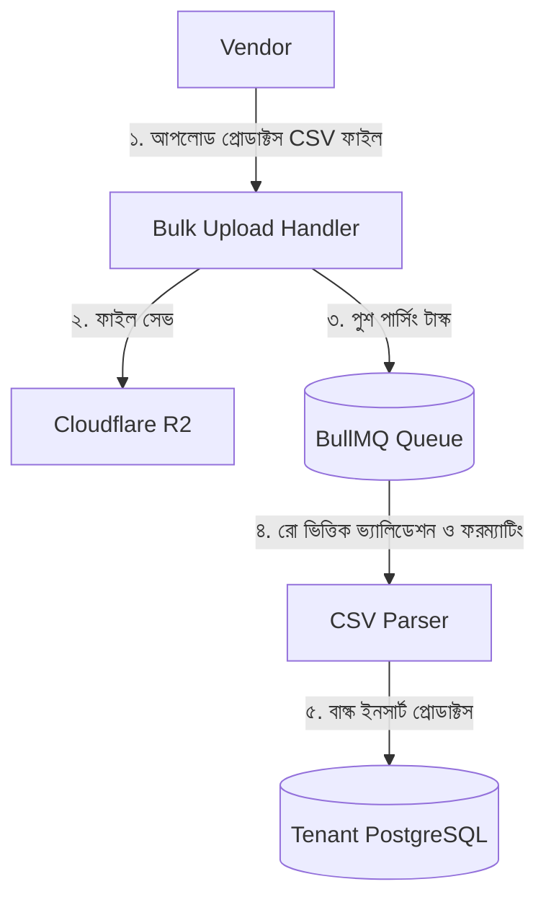
```mermaid
graph TD
    Vendor["Vendor"] -->|"১. আপলোড প্রোডাক্টস CSV ফাইল"| Upload["Bulk Upload Handler"]
    Upload -->|"২. ফাইল সেভ"| Storage["Cloudflare R2"]
    Upload -->|"৩. পুশ পার্সিং টাস্ক"| Queue[("BullMQ Queue")]
    Queue -->|"৪. রো ভিত্তিক ভ্যালিডেশন ও ফরম্যাটিং"| Parser["CSV Parser"]
    Parser -->|"৫. বাল্ক ইনসার্ট প্রোডাক্টস"| DB[("Tenant PostgreSQL")]
```

### **২.৩ Product Variant & SKU Generation (প্রোডাক্ট ভ্যারিয়েন্ট ও SKU তৈরি)**
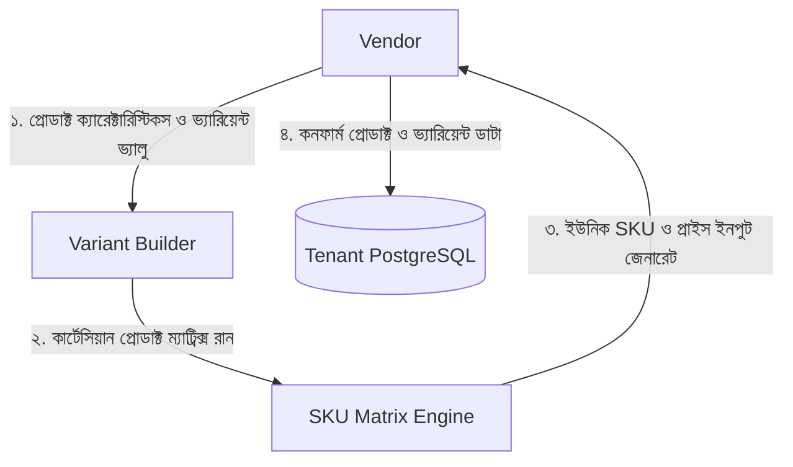
```mermaid
graph TD
    Vendor["Vendor"] -->|"১. প্রোডাক্ট ক্যারেক্টারিস্টিকস ও ভ্যারিয়েন্ট ভ্যালু"| Builder["Variant Builder"]
    Builder -->|"২. কার্টেসিয়ান প্রোডাক্ট ম্যাট্রিক্স রান"| Matrix["SKU Matrix Engine"]
    Matrix -->|"৩. ইউনিক SKU ও প্রাইস ইনপুট জেনারেট"| Vendor
    Vendor -->|"৪. কনফার্ম প্রোডাক্ট ও ভ্যারিয়েন্ট ডাটা"| DB[("Tenant PostgreSQL")]
```

### **২.৪ Inventory Tracking & Low Stock Alert (ইনভেন্টরি ট্র্যাকিং ও অ্যালার্ট)**
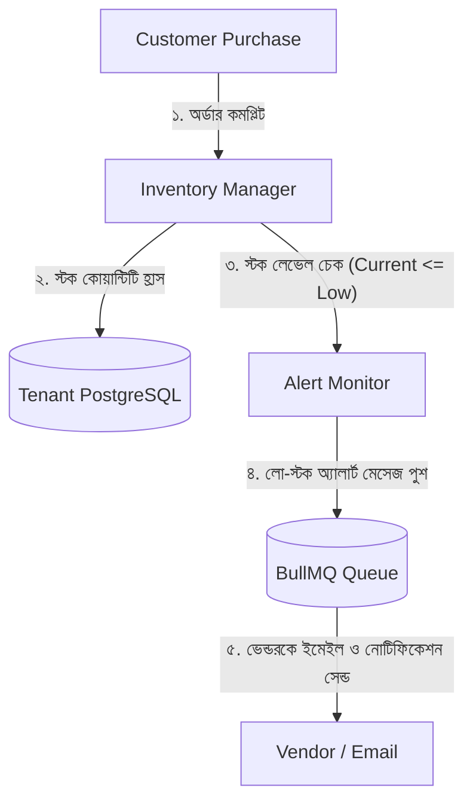
```mermaid
graph TD
    Cust["Customer Purchase"] -->|"১. অর্ডার কমপ্লিট"| Inv["Inventory Manager"]
    Inv -->|"২. স্টক কোয়ান্টিটি হ্রাস"| DB[("Tenant PostgreSQL")]
    Inv -->|"৩. স্টক লেভেল চেক (Current <= Low)"| Alert["Alert Monitor"]
    Alert -->|"৪. লো-স্টক অ্যালার্ট মেসেজ পুশ"| Queue[("BullMQ Queue")]
    Queue -->|"৫. ভেন্ডরকে ইমেইল ও নোটিফিকেশন সেন্ড"| Vendor["Vendor / Email"]
```

### **২.৫ Supplier Management (সাপ্লায়ার CRUD ও ব্যাচ ট্র্যাকিং)**
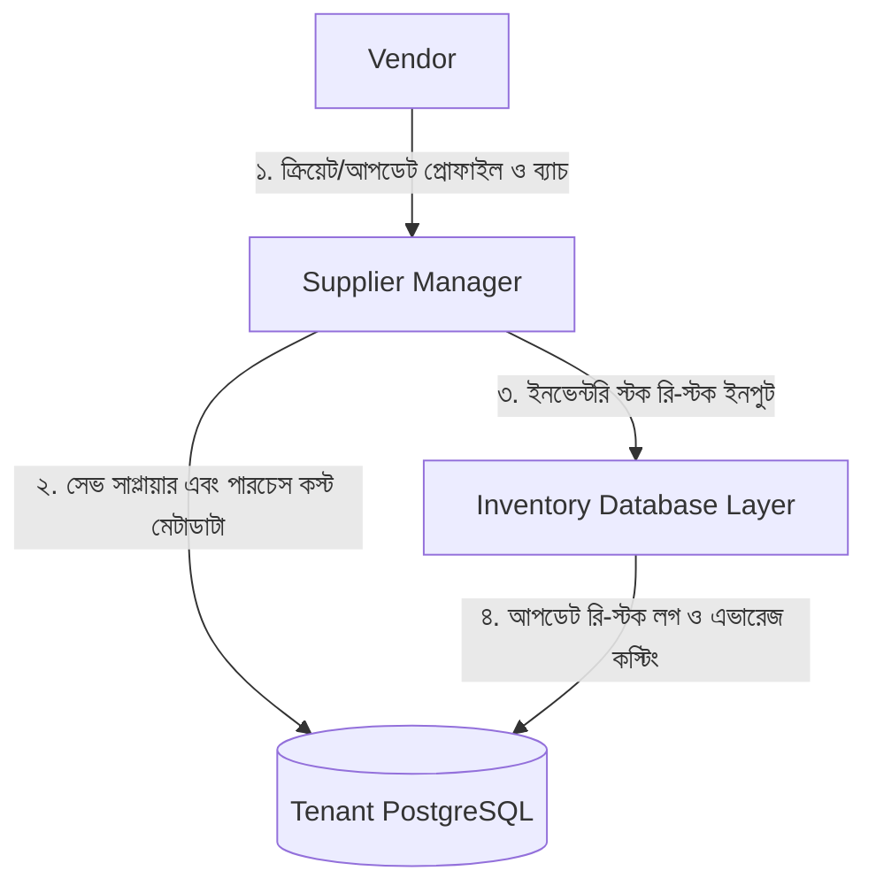
```mermaid
graph TD
    Vendor["Vendor"] -->|"১. ক্রিয়েট/আপডেট প্রোফাইল ও ব্যাচ"| Input["Supplier Manager"]
    Input -->|"২. সেভ সাপ্লায়ার এবং পারচেস কস্ট মেটাডাটা"| DB[("Tenant PostgreSQL")]
    Input -->|"৩. ইনভেন্টরি স্টক রি-স্টক ইনপুট"| Inventory["Inventory Database Layer"]
    Inventory -->|"৪. আপডেট রি-স্টক লগ ও এভারেজ কস্টিং"| DB
```

### **২.৬ Order Pipeline & Fulfillment (অর্ডার প্রসেস ও কুরিয়ার বুকিং)**
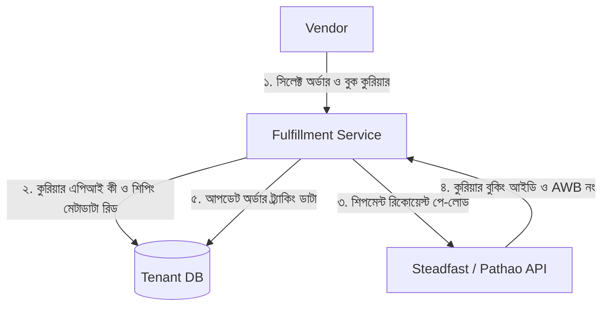
```mermaid
graph TD
    Vendor["Vendor"] -->|"১. সিলেক্ট অর্ডার ও বুক কুরিয়ার"| Fulfill["Fulfillment Service"]
    Fulfill -->|"২. কুরিয়ার এপিআই কী ও শিপিং মেটাডাটা রিড"| DB[("Tenant DB")]
    Fulfill -->|"৩. শিপমেন্ট রিকোয়েস্ট পে-লোড"| Courier["Steadfast / Pathao API"]
    Courier -->|"৪. কুরিয়ার বুকিং আইডি ও AWB নং"| Fulfill
    Fulfill -->|"৫. আপডেট অর্ডার ট্র্যাকিং ডাটা"| DB
```

### **২.৭ Discount & Coupon Engine (ডিসকাউন্ট ও কুপন কোড জেনারেটর)**
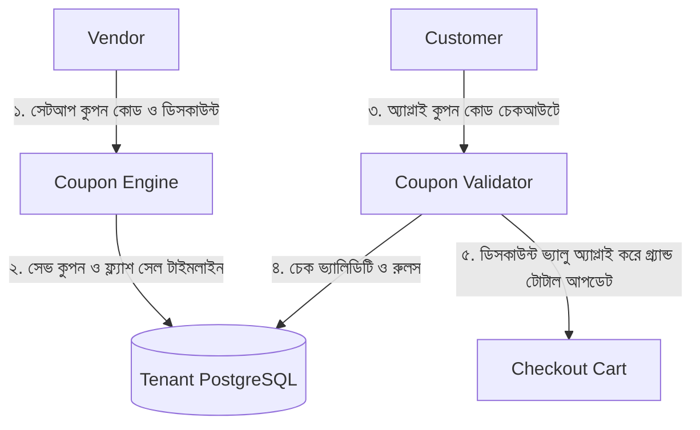
```mermaid
graph TD
    Vendor["Vendor"] -->|"১. সেটআপ কুপন কোড ও ডিসকাউন্ট"| CouponCreator["Coupon Engine"]
    CouponCreator -->|"২. সেভ কুপন ও ফ্ল্যাশ সেল টাইমলাইন"| DB[("Tenant PostgreSQL")]
    Cust["Customer"] -->|"৩. অ্যাপ্লাই কুপন কোড চেকআউটে"| CouponValidator["Coupon Validator"]
    CouponValidator -->|"৪. চেক ভ্যালিডিটি ও রুলস"| DB
    CouponValidator -->|"৫. ডিসকাউন্ট ভ্যালু অ্যাপ্লাই করে গ্র্যান্ড টোটাল আপডেট"| Checkout["Checkout Cart"]
```

### **২.৮ Visitor & Conversion Analytics (স্টোর অ্যানালিটিক্স)**
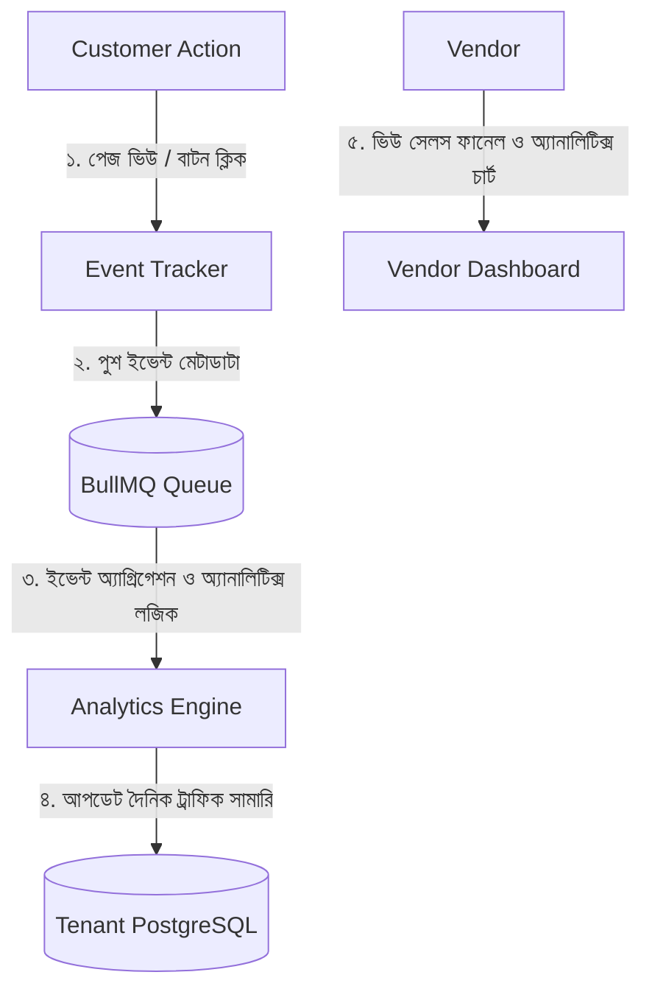
```mermaid
graph TD
    Request["Customer Action"] -->|"১. পেজ ভিউ / বাটন ক্লিক"| Tracker["Event Tracker"]
    Tracker -->|"২. পুশ ইভেন্ট মেটাডাটা"| Queue[("BullMQ Queue")]
    Queue -->|"৩. ইভেন্ট অ্যাগ্রিগেশন ও অ্যানালিটিক্স লজিক"| Engine["Analytics Engine"]
    Engine -->|"৪. আপডেট দৈনিক ট্রাফিক সামারি"| DB[("Tenant PostgreSQL")]
    Vendor["Vendor"] -->|"৫. ভিউ সেলস ফানেল ও অ্যানালিটিক্স চার্ট"| Dashboard["Vendor Dashboard"]
```

### **২.৯ Pixel Tracking Injector (ফেসবুক পিক্সেল ও GA4 স্ক্রিপ্ট ইনজেকশন)**
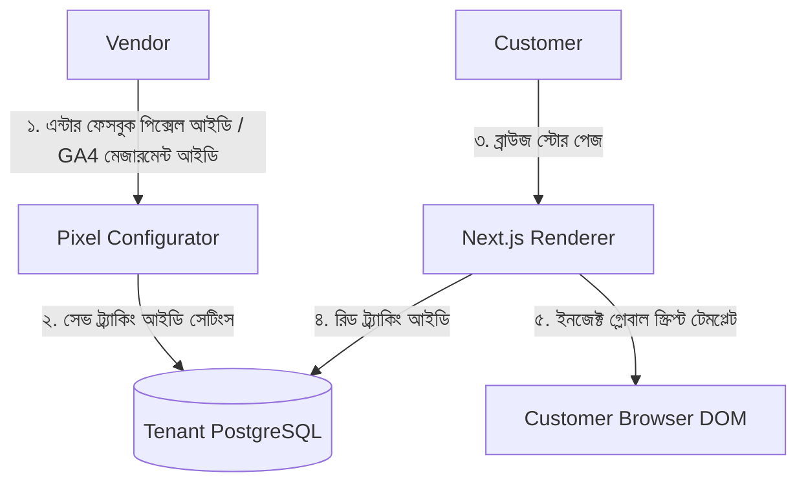
```mermaid
graph TD
    Vendor["Vendor"] -->|"১. এন্টার ফেসবুক পিক্সেল আইডি / GA4 মেজারমেন্ট আইডি"| Input["Pixel Configurator"]
    Input -->|"২. সেভ ট্র্যাকিং আইডি সেটিংস"| DB[("Tenant PostgreSQL")]
    Cust["Customer"] -->|"৩. ব্রাউজ স্টোর পেজ"| PageRender["Next.js Renderer"]
    PageRender -->|"৪. রিড ট্র্যাকিং আইডি"| DB
    PageRender -->|"৫. ইনজেক্ট গ্লোবাল স্ক্রিপ্ট টেমপ্লেট"| CustStore["Customer Browser DOM"]
```

### **২.১০ Manual Shipping Configuration (ম্যানুয়াল শিপিং রেট কনফিগ)**
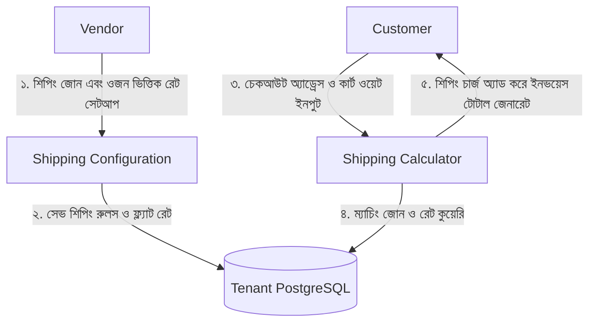
```mermaid
graph TD
    Vendor["Vendor"] -->|"১. শিপিং জোন এবং ওজন ভিত্তিক রেট সেটআপ"| Config["Shipping Configuration"]
    Config -->|"২. সেভ শিপিং রুলস ও ফ্ল্যাট রেট"| DB[("Tenant PostgreSQL")]
    Cust["Customer"] -->|"৩. চেকআউট অ্যাড্রেস ও কার্ট ওয়েট ইনপুট"| Calc["Shipping Calculator"]
    Calc -->|"৪. ম্যাচিং জোন ও রেট কুয়েরি"| DB
    Calc -->|"৫. শিপিং চার্জ অ্যাড করে ইনভয়েস টোটাল জেনারেট"| Cust
```

---

## **৩. Customer Storefront Features**

### **৩.১ Storefront Render & Edge Cache (স্টোরফ্রন্ট লোড ও ক্যাশ)**
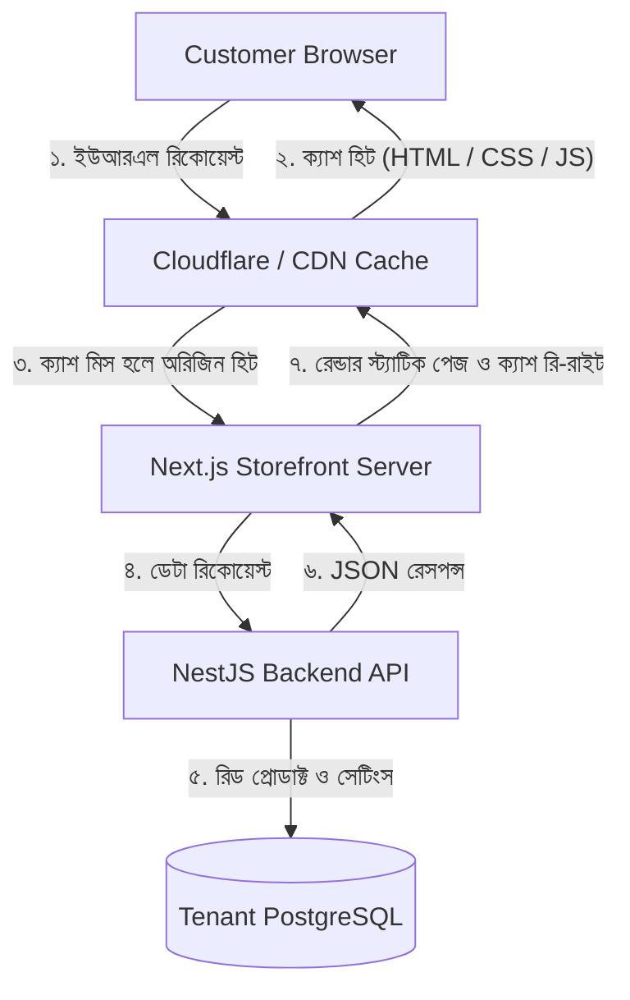
```mermaid
graph TD
    Cust["Customer Browser"] -->|"১. ইউআরএল রিকোয়েস্ট"| Edge["Cloudflare / CDN Cache"]
    Edge -->|"২. ক্যাশ হিট (HTML / CSS / JS)"| Cust
    Edge -->|"৩. ক্যাশ মিস হলে অরিজিন হিট"| Next["Next.js Storefront Server"]
    Next -->|"৪. ডেটা রিকোয়েস্ট"| API["NestJS Backend API"]
    API -->|"৫. রিড প্রোডাক্ট ও সেটিংস"| DB[("Tenant PostgreSQL")]
    API -->|"৬. JSON রেসপন্স"| Next
    Next -->|"৭. রেন্ডার স্ট্যাটিক পেজ ও ক্যাশ রি-রাইট"| Edge
```

### **৩.২ Catalog Search & Filter Engine (ইনস্ট্যান্ট ক্যাটালগ সার্চ ও ফিল্টার)**
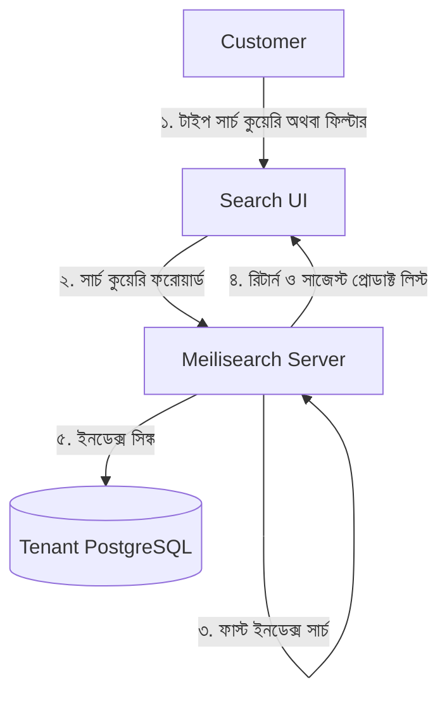
```mermaid
graph TD
    Cust["Customer"] -->|"১. টাইপ সার্চ কুয়েরি অথবা ফিল্টার"| Input["Search UI"]
    Input -->|"২. সার্চ কুয়েরি ফরোয়ার্ড"| SearchEngine["Meilisearch Server"]
    SearchEngine -->|"৩. ফাস্ট ইনডেক্স সার্চ"| SearchEngine
    SearchEngine -->|"৪. রিটার্ন ও সাজেস্ট প্রোডাক্ট লিস্ট"| Input
    SearchEngine -->|"৫. ইনডেক্স সিঙ্ক"| DB[("Tenant PostgreSQL")]
```

### **৩.৩ Quick Checkout & Cart Sync (দ্রুত চেকআউট ও কার্ট সিঙ্ক)**
```mermaid
graph TD
    Cust["Customer"] -->|"১. মডিফাই কার্ট প্রোডাক্টস"| CartUI["Cart UI"]
    CartUI -->|"২. আপডেট কার্ট স্টেট"| Local["Local Storage"]
    Local -->|"৩. ক্লিক চেকআউট"| Checkout["Checkout Flow"]
    Checkout -->|"৪. গেট কার্ট আইটেম ভ্যালু ও ভ্যালিডেশন"| API["NestJS API"]
    API -->|"৫. চেক কারেন্ট ইনভেন্টরি লেভেল"| DB[("Tenant PostgreSQL")]
    API -->|"৬. রিটার্ন কার্ট প্রাইসিং ব্রেকডাউন"| Checkout
```

### **৩.৪ COD Check-out with Mobile OTP Verification (ওটিপি চেকআউট)**
```mermaid
graph TD
    Cust["Customer"] -->|"১. ফোন নম্বর ও শিপিং তথ্য ইনপুট"| Checkout["Checkout Flow"]
    Checkout -->|"২. ওটিপি কোড জেনারেশন (৬ ডিজিট)"| Redis[("Redis Memory")]
    Checkout -->|"৩. ওটিপি কোড SMS সেন্ড"| Gateway["SMS Gateway API"]
    Gateway -->|"৪. মোবাইলে ওটিপি রিসিভ"| Cust
    Cust -->|"৫. ওটিপি কোড সাবমিট ও ম্যাচ ভেরিফাই"| Redis
    Redis -->|"৬. ওটিপি সঠিক হলে অর্ডার কনফার্ম"| Checkout
    Checkout -->|"৭. সেভ অর্ডার ও ইনভেন্টরি লক"| DB[("Tenant PostgreSQL")]
```

### **৩.৫ Online Payment Gateways Integration (বিকাশ, নগদ ও কার্ড পেমেন্ট)**
```mermaid
graph TD
    Cust["Customer"] -->|"১. সিলেক্ট করুন অনলাইন পেমেন্ট"| Checkout["Checkout Flow"]
    Checkout -->|"২. ইনিশিয়েট পেমেন্ট সেশন"| PG["bKash / Nagad / SSLCommerz Gateway"]
    PG -->|"৩. ইউজার পেমেন্ট স্ক্রিন ও পিন ইনপুট"| Cust
    PG -->|"৪. পেমেন্ট অথোরাইজেশন সাকসেস"| Webhook["IPN Callback Listener"]
    Webhook -->|"৫. ভেরিফাই পেমেন্ট সিগনেচার ও ট্রানজেকশন"| API["NestJS Backend API"]
    API -->|"৬. আপডেট অর্ডার স্ট্যাটাস (Paid) ও মেমো জেনারেট"| DB[("Tenant PostgreSQL")]
```

### **৩.৬ Order Tracking Page (পাবলিক অর্ডার ট্র্যাকিং)**
```mermaid
graph TD
    Cust["Customer"] -->|"১. এন্টার অর্ডার আইডি ও মোবাইল নম্বর"| TrackForm["Tracking Page UI"]
    TrackForm -->|"২. সার্চ কুয়েরি ট্র্যাকিং ডাটা"| API["NestJS Backend API"]
    API -->|"৩. রিড অর্ডার ও কুরিয়ার ট্র্যাকিং স্ট্যাটাস"| DB[("Tenant PostgreSQL")]
    API -->|"৪. রিয়েল-টাইম কুরিয়ার স্ট্যাটাস পুল"| Courier["Courier API"]
    Courier -->|"৫. রিটার্ন অর্ডার জার্নি হিস্ট্রি"| TrackForm
```

---

## **৪. Security & Anti-Fraud Features**

### **৪.১ Anti-Fake Order Prevention (ভুয়া অর্ডার প্রতিরোধ)**
```mermaid
graph TD
    Cust["Customer Order Submit"] -->|"১. অর্ডার ট্র্রিগার"| Filter["Anti-Fraud Filter"]
    Filter -->|"২. ডিভাইস আইডি ও আইপি চেক"| Redis[("Redis Analytics Log")]
    Filter -->|"৩. ফোন নম্বর ব্লকলিস্ট ভেরিফিকেশন"| DB[("Tenant DB")]
    
    Filter -->|"৪. লিমিট এক্সিড (সন্দেহজনক)"| Block["Block & Show Warning"]
    Block -->|"৫. নোটিফিকেশন"| Cust
    
    Filter -->|"৬. ট্রাস্টেড রিকোয়েস্ট"| OTP["OTP Flow"]
```

### **৪.২ Resource Quota & Page view Tracker (রিসোর্স ট্রাফিক ট্র্যাকিং)**
```mermaid
graph TD
    Request["Incoming Request"] -->|"১. ট্রাফিক হিট"| Tracker["Traffic Counter"]
    Tracker -->|"২. ইনক্রিমেন্ট ভেন্ডর কাউন্টার (ভিজিটর / মিনিট)"| Redis[("Redis Counter")]
    Tracker -->|"৩. প্যাকেজ ট্রাফিক কোটা চেক"| MasterDB[("Master Database")]
    
    Tracker -->|"৪. ১০০% লিমিট রিচ"| Overload["Overload Handler"]
    Overload -->|"৫. সার্ভ স্ট্যাটিক পেজ"| Edge["Next.js Server"]
    Overload -->|"৬. অ্যালার্ট ইমেইল"| Alert["Email / Dashboard Notification"]
    
    Tracker -->|"৭. কোটা সচল"| API["Backend Engine"]
```
