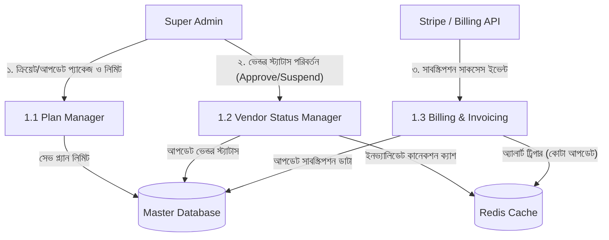
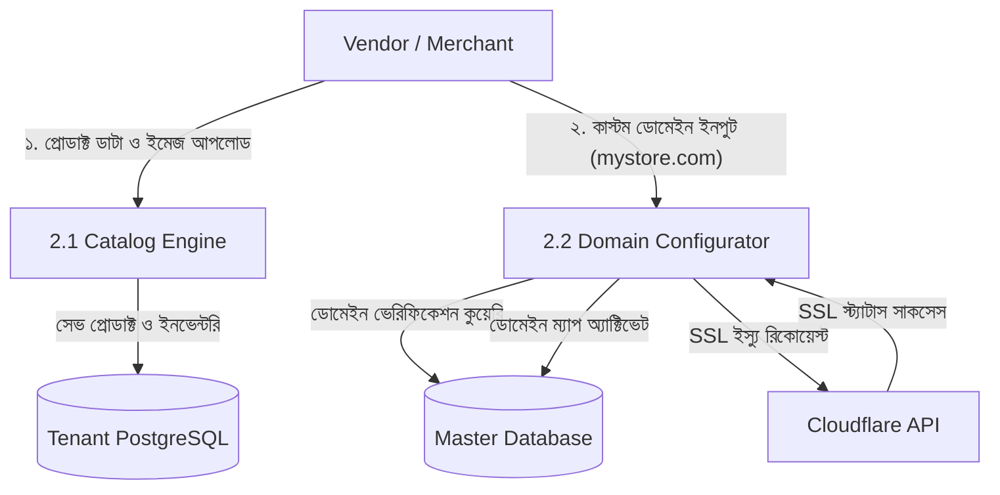
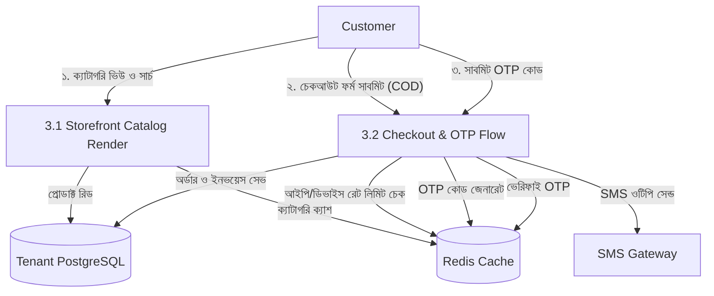
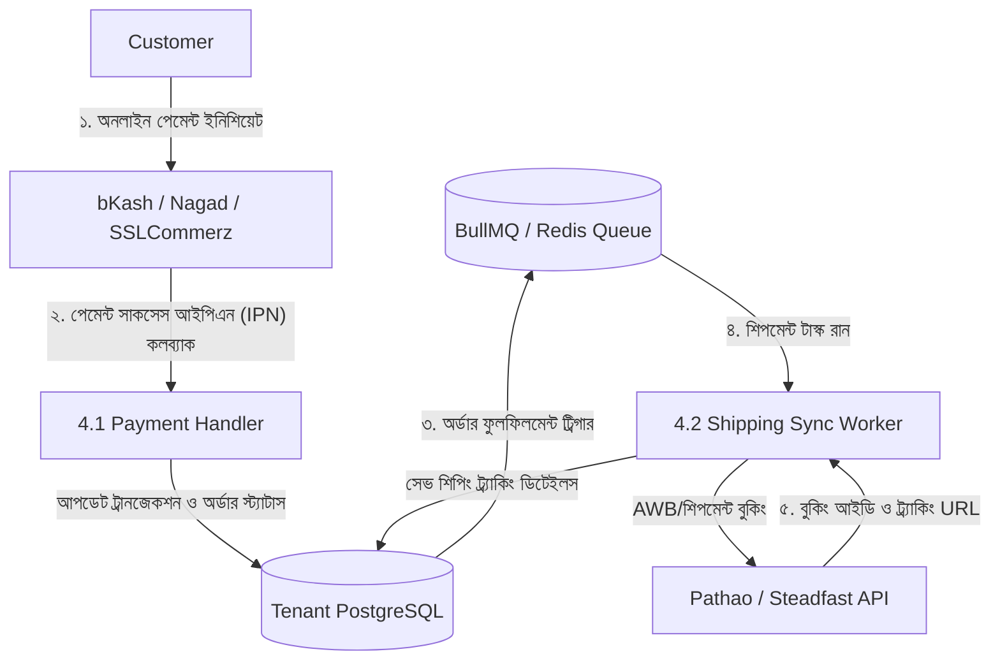
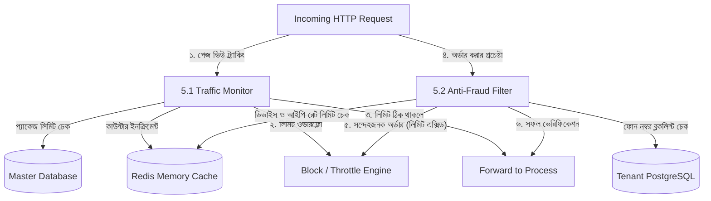

# Ecomize — Module-Wise Data Flow Diagrams (DFDs)

---

## **১. Super Admin Module (সুপার এডমিন মডিউল)**
ভেন্ডর অনবোর্ডিং, বিলিং ও রিসোর্স প্ল্যান ম্যানেজমেন্টের ফ্লো:

---

## **২. Vendor Dashboard Module (মার্চেন্ট মডিউল)**
প্রোডাক্ট লিস্টিং, ইনভেন্টরি আপডেট এবং কাস্টম ডোমেইন উইজার্ডের ফ্লো:

---

## **৩. Customer Storefront Module (স্টোরফ্রন্ট মডিউল)**
গ্রাহকের প্রোডাক্ট ব্রাউজিং, সার্চ এবং কার্ট থেকে অর্ডার প্লেসমেন্টের ফ্লো:

---

## **৪. Integration Module (এক্সটার্নাল এপিআই মডিউল)**
কুরিয়ার সার্ভিস এবং পেমেন্ট গেটওয়ের ব্যাকগ্রাউন্ড প্রসেসের ফ্লো:

---

## **৫. Anti-Fraud & Traffic Quota Module (নিরাপত্তা ও কোটা মডিউল)**
ভেন্ডরের ট্রাফিক সীমা মনিটরিং ও ভুয়া অর্ডার ডিটেকশনের ফ্লো:

