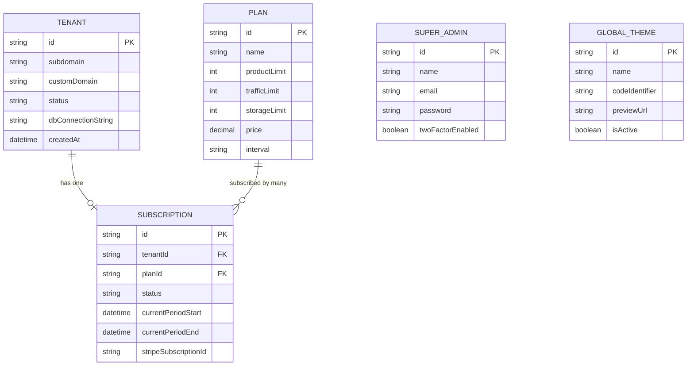
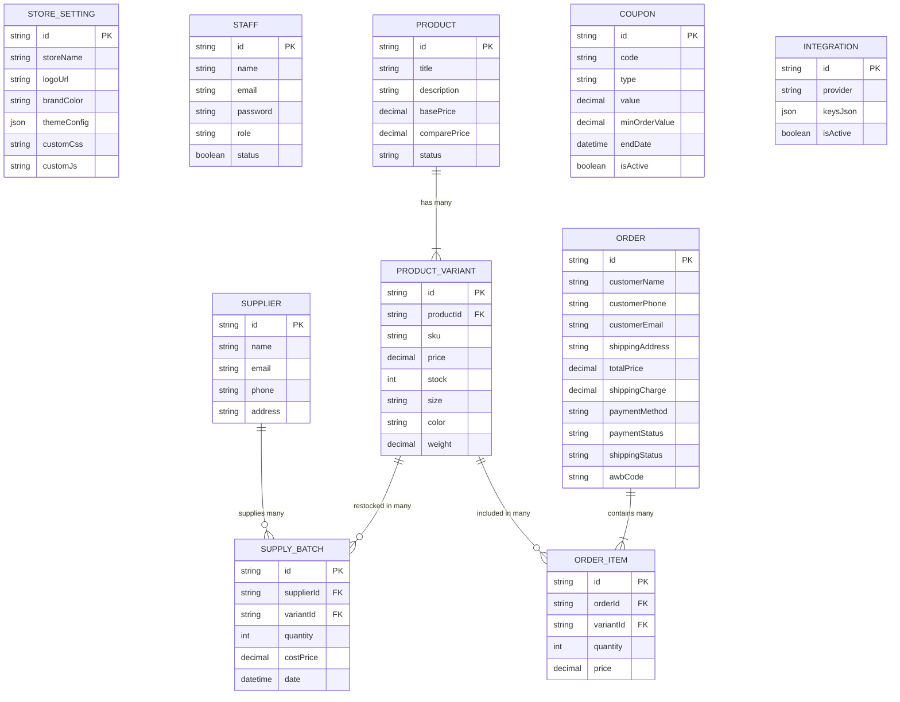

# Ecomize — Database Entity-Relationship Diagram (ERD) & Relationships

---

## **১. Central / Master Database ERD**

সেন্ট্রাল ডাটাবেসের টেবিলগুলোর মধ্যকার সম্পর্ক (১:১ এবং ১:N সম্পর্ক):

---

## **২. Tenant Database ERD (প্রতি ভেন্ডরের নিজস্ব ডাটাবেস)**

ভেন্ডরের ইন্টারনাল ডাটাবেসের টেবিলগুলোর সম্পর্ক:

---

## **৩. সম্পর্কের বিবরণী (Relationship Details)**

### **৩.১ Master DB Relationships**
* **Tenant (১:১) Subscription:** প্রতিটি টেন্যান্টের (ভেন্ডর) সর্বোচ্চ একটি সক্রিয় সাবস্ক্রিপশন থাকতে পারবে।
* **Plan (১:N) Subscription:** একটি সাবস্ক্রিপশন প্ল্যানের (যেমন: প্রোপ্ল্যান) অধীনে একাধিক ভেন্ডর সাবস্ক্রাইব করতে পারবে।

### **৩.২ Tenant DB Relationships**
* **Product (১:N) ProductVariant:** একটি মূল প্রোডাক্টের অধীনে একাধিক সাইজ, কালার বা ভ্যারিয়েন্ট থাকতে পারে (যেমন: T-Shirt -> Red-M, Blue-L)।
* **ProductVariant (১:N) OrderItem:** একটি নির্দিষ্ট প্রোডাক্ট ভ্যারিয়েন্ট একাধিক অর্ডারের লাইন আইটেম হতে পারে।
* **Order (১:N) OrderItem:** একটি অর্ডারের ভেতর একাধিক কার্ট প্রোডাক্ট (Order Items) থাকতে পারে।
* **Supplier (১:N) SupplyBatch:** একজন সাপ্লাইয়ার একাধিক সময়ে কাঁচামাল বা প্রোডাক্ট ব্যাচ সাপ্লাই করতে পারেন।
* **ProductVariant (১:N) SupplyBatch:** একটি প্রোডাক্ট ভ্যারিয়েন্টের স্টক একাধিক ব্যাচে আসতে পারে, যা দিয়ে গড় কেনা খরচ (Average Costing) হিসাব করা হবে।
